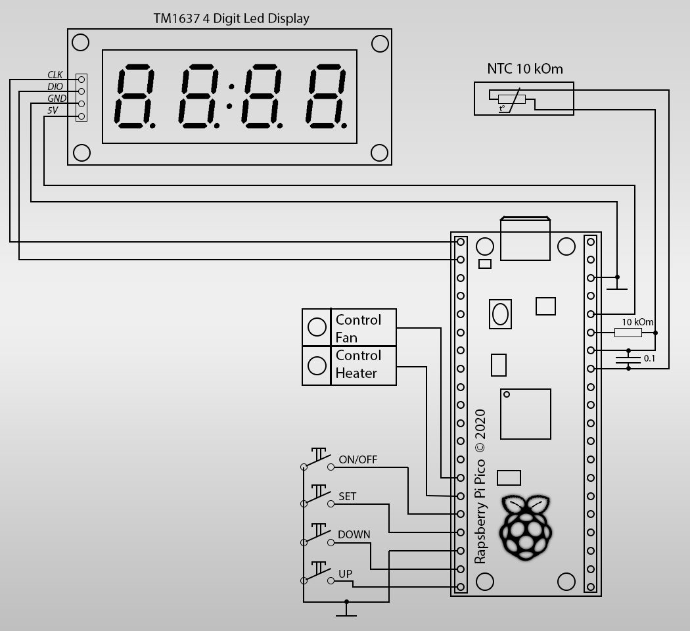

# Терморегулятор с таймером
Устройство предназначено для сушильной установки. 
Основная функция - термостабилизация воздушного потока в течении установленного временного интервала.

Для контроля состояния и установки параметров устройство содержит четырехразрядный 7-сегментный светодиодный индикатор.
Управление устройством осуществляется четырьмя кнопками.
В качестве термодатчика используется NTC термистор.
Микроконтроллер - RP2040 [Raspberry Pi Pico](https://www.raspberrypi.com/products/raspberry-pi-pico/).

# Schematic diagram

# Demo

